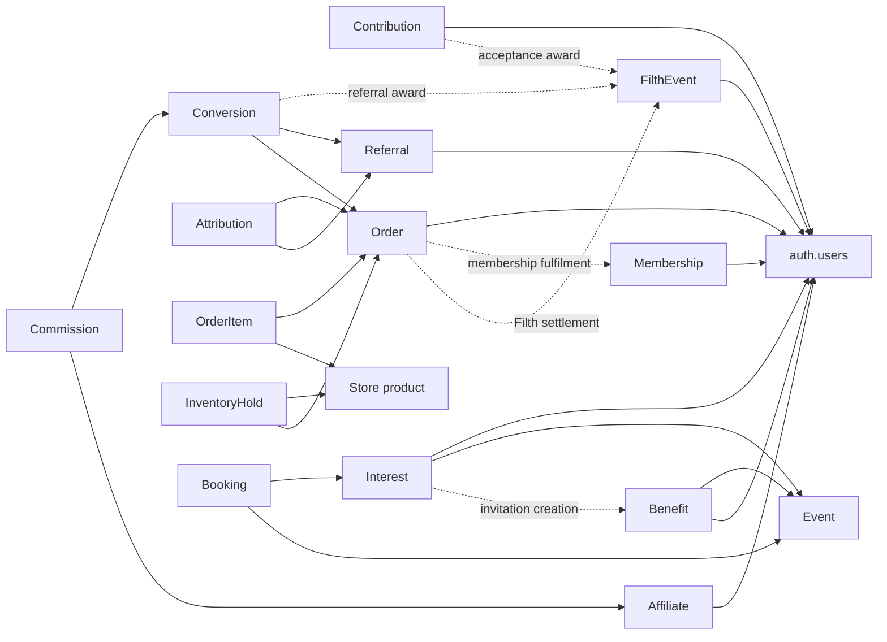
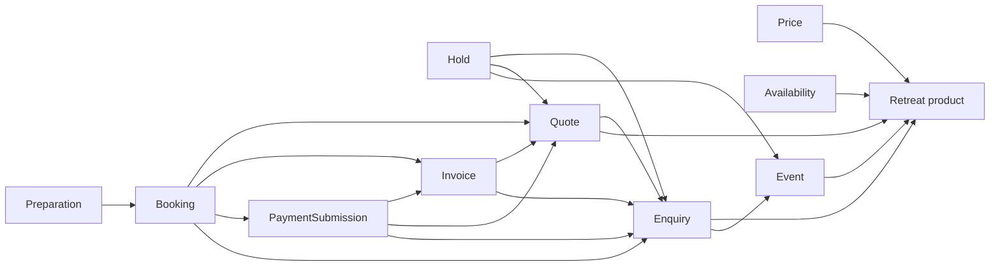

# Filthy Princess business platform map

Repository snapshot: 22 September 2026. Scope: 73 SQL migration files, current `lib/database.types.ts`, and directly related application calls. **39 application business tables**, all in `public`; `auth.users` and Storage are additional platform dependencies, not included in that count.

This is a static map of the current working tree, including uncommitted September 22 migrations and application changes. It is not a statement that those migrations have been deployed, replayed successfully, or verified against live data. No database connection, tests, migration execution, or application changes were performed for this document.

Evidence notation: **DB** means constraints, grants, RLS, triggers or RPC logic; **App** means application behavior; **Capability** means schema/function support without an identified active application path. Historical definitions are superseded by later definitions unless explicitly discussed as retained parallel paths. References below are repository-relative.

## 1. Executive summary

Filthy Princess already contains a transactional business platform, not just content for a website. Its strongest connected flows are:

- Authenticated participation → reviewed contribution → Filth ledger → lifetime progression and spendable balance → Store redemption.
- Affiliate terms acceptance → referral attribution → verified membership purchase → referral Filth and a frozen commission award.
- Store acquisition → inventory commitment → verified money payment or atomic Filth settlement → membership grant or manual fulfilment.
- Retreat enquiry → reserved dates → quote → invoice → reviewed payment → booking → guest preparation.
- Member event interest → Admin selection → personal invitation → acceptance → explicit booking confirmation.

Membership is a common access boundary, but not the sole identity or commercial boundary. Free authenticated users can contribute and become affiliates. Product-specific Filth audiences can also permit non-members to redeem. Retreat guests usually exist as enquiry contact records rather than linked authenticated customers.

The largest incomplete connections are commission payout, universal customer identity across retreats and membership, automated non-membership fulfilment, and financial reversals/reconciliation. Several older paths remain callable alongside newer ones. They should not be mistaken for one uniformly enforced workflow.

## 2. Business domains

| Domain | Encoded capability | Boundary |
| --- | --- | --- |
| Identity and operations | Auth users and Admin allowlist | No separate customer/profile master table |
| Membership and entitlement | Lifetime membership grant, suspension, restoration, cancellation | Access is active and unexpired membership |
| Contribution | Submission, review, acceptance, manual Filth award | Any authenticated participant; Admin decides reward |
| Filth economy | One ledger, Lifetime/Available balances, levels, milestones, redemption | Not a cash ledger |
| Referral and Affiliate | Identity, terms, attribution, conversion, commission snapshots | Commercial readiness is independent of membership |
| Commerce | Product configuration and single-product order snapshots | Money or Filth acquisition |
| Inventory | Product capacity and timed order holds | Distinct from retreat date occupancy |
| Payment and fulfilment | Manual money verification, Filth settlement, membership/manual fulfilment, legacy claims | No universal payment/fulfilment tables |
| Inner Sanctum content and participation | Posts, tasks, collectibles, personal benefits | Publication, ownership and entitlement combine |
| Events | Scheduled group retreats, interest, invitations and capacity | Uses retreat products/bookings |
| Retreat operations | Products, prices, availability, enquiries, holds, quotes, invoices, bookings, preparation | Contact/link-based guest journey |
| Promotional publishing | Teasers and media linked to Store or contribution promotion | Published slug read; separate from Sanctum posts |

Admin is a cross-domain operating surface, not a separate duplicate business model.

## 3. Core entities

The principal entities are **User, Admin, Membership, Contribution, Filth Event, Level, Milestone Definition, Earned Milestone, Affiliate Account, Referral Identity, Attribution, Conversion, Commission, Store Product, Store Order, Order Item, Inventory Hold, Fulfilment Authorization, Claim, Post, Task, Task Response, Collectible, Collectible Grant, Personal Benefit, Retreat Product, Price, Availability Window, Event, Event Interest, Enquiry, Retreat Hold, Quote, Invoice, Payment Submission, Booking, Booking Preparation and Teaser**.

Important absences from that noun list:

- Store inventory is configuration on a product plus holds and paid quantities; there is no separate inventory master.
- Store payment and fulfilment are order fields and controlled operations, not separate payment or shipment entities.
- Invitation is a personal benefit, not a standalone invitation table.
- A level is dynamically selected, not a stored user-level assignment.
- Lifetime and Available Filth are derived balances, not wallet rows.
- No commission payout/request entity exists.

## 4. Database inventory

All tables below are in **`public`**. Primary key is **`id uuid`** unless explicitly shown otherwise. `User` means an actual FK to `auth.users`; actor/reviewer FKs are noted where important. Categories: **C** configuration/definition; **A** authored content; **U** user-owned state; **T** transaction/workflow; **H** recorded history/snapshot. H does not automatically mean database-immutable: protection differs by table.

### Identity and membership — 2 tables

| Table | Purpose/category | Important keys and state | Main contracts |
| --- | --- | --- | --- |
| `admin_users` | Admin allowlist, C | PK `user_id` → User | `retreat_private.is_retreat_admin`; App `requireAdmin` |
| `inner_sanctum_memberships` | One current lifetime entitlement per person, U | Unique `user_id` → User; `last_changed_by` → User; active/suspended/cancelled, expiry and transition timestamps | `has_inner_sanctum_access`, `get_my_inner_sanctum_access`, `admin_list_inner_sanctum_members`, `admin_transition_inner_sanctum_membership`; private `apply_membership_transition` |

### Contribution and Filth — 6 tables

| Table | Purpose/category | Important keys and state | Main contracts |
| --- | --- | --- | --- |
| `contribution_submissions` | Work/idea review and award, T/H | User and reviewer → User; submitted/reviewing/accepted/declined; award and paid-opportunity flag | `submit_contribution`, `admin_get_contributions`, `admin_mark_contribution_reviewing`, `admin_accept_contribution`, `admin_decline_contribution`, `get_my_contributions` |
| `inner_sanctum_filth_events` | Sole Filth ledger, H | User/creator → User; unique `source_reference`; event type, event class, signed points | Contribution acceptance, referral conversion, `admin_add_filth_points`, `settle_my_filth_store_order`; progression reads |
| `inner_sanctum_filth_settings` | Referral earning setting, C | PK singleton boolean `id=true`; `referral_points` | `record_successful_referral_conversion` reads |
| `inner_sanctum_filth_levels` | Named threshold curve, C | Unique level number and threshold; active/inactive; sort order | `get_my_filth_progression`; Admin referral display |
| `inner_sanctum_filth_milestones` | Reward threshold definitions, C | Optional `level_id` → levels; threshold/title uniqueness; active/inactive; reward type and textual reference | `evaluate_filth_milestones`, `get_my_filth_milestones` |
| `inner_sanctum_member_filth_milestones` | Earned award record, U/H | User + milestone FK, unique pair; earned/fulfilled timestamps and fulfilment reference | `evaluate_filth_milestones` inserts idempotently; personal progress reads |

### Referral and Affiliate — 6 tables

| Table | Purpose/category | Important keys and state | Main contracts |
| --- | --- | --- | --- |
| `affiliate_accounts` | Commercial participation/terms, U | Unique User; active/suspended/closed; accepted terms version/timestamp | `accept_current_affiliate_terms`, `get_my_affiliate_state`, private `ensure_account`, `is_commercially_ready` |
| `inner_sanctum_referrals` | Reusable referral identity, U | Unique User and code; active/disabled | `get_or_create_my_referral_identity`, `is_valid_inner_sanctum_referral_code`; Admin status action |
| `store_order_referrals` | Order attribution, T/H | Unique order → orders; referral → referrals; referrer → User; conversion → conversions | Order creation inserts; conversion links and timestamps |
| `inner_sanctum_referral_conversions` | Successful qualifying acquisition, H | Referral, order, referrer/referred User FKs; unique order and referred user; points/source snapshot | Private `record_successful_referral_conversion`; Admin test wrapper |
| `affiliate_commission_settings` | Default commercial rule and hold duration, C | PK singleton boolean `id=true`; percentage/fixed, value, hold days | `create_conversion_commission` reads |
| `affiliate_commissions` | Monetary entitlement snapshot, H | Unique conversion; affiliate account and referrer User FKs; pending/available; maturity dates | `create_conversion_commission`, `mature_due_commissions`, `get_my_affiliate_earnings` |

### Store, inventory and fulfilment — 6 tables

| Table | Purpose/category | Important keys and state | Main contracts |
| --- | --- | --- | --- |
| `store_products` | Catalogue/acquisition/inventory definition, C/A | Unique slug; draft/active/archived; product/fulfilment type, prices, audiences, inventory | Admin product actions; public catalogue reads; order creation |
| `store_orders` | Purchase identity and commercial/payment state, T/H | Optional User; unique reference/request key; pending/paid/cancelled/failed; pending/submitted/verified/rejected payment; money/filth; fulfilment timestamps and actors | `create_public_store_order`, `bind_my_store_order`, `get_my_store_checkout`, `submit_my_store_payment`, verification/rejection, Filth settlement, manual fulfilment |
| `store_order_items` | Frozen single-product snapshot, H | Unique order FK; product FK; quantity constrained to 1 | Created with order; snapshot update/delete trigger blocks changes |
| `store_inventory_holds` | Limited-stock reservation, T | Product FK; unique order FK; held/sold/released; expiry and terminal timestamps | Private `reserve_inventory`, `consume_inventory`, `release_inventory`; `get_my_store_inventory_hold` |
| `store_fulfillment_authorizations` | Legacy claim authorization/provenance, T/H | Unique order; authorizer → User; admin/payfast source | `admin_authorize_store_fulfillment`, `admin_get_store_fulfillment` |
| `store_claims` | Bearer-token membership claim, T | Order FK; composite authorization/order FK; unique token hash; claimant → User; available/claimed/revoked; optional expiry | `get_store_claim_state`, `redeem_store_claim`, Admin reissue/revoke |

### Inner Sanctum — 6 tables

| Table | Purpose/category | Important keys and state | Main contracts |
| --- | --- | --- | --- |
| `inner_sanctum_posts` | Editorial feed, A | Creator → User; message/feature/drop/task/benefit presentation type; draft/published/archived; publication/expiry | Admin publishing actions; `get_inner_sanctum_posts` |
| `inner_sanctum_collectibles` | Collection item definition, A/C | Unique slug; draft/active/archived; media path/type | Admin collection actions; `get_my_inner_sanctum_collection` |
| `inner_sanctum_member_collectibles` | Owned collectible, U/H | Unique User/collectible pair; grant actor → User; source/reference | `admin_grant_inner_sanctum_collectible`; collection read |
| `inner_sanctum_benefits` | Personal gift/invitation/experience, A/U | Recipient/creator → User; optional retreat event FK; draft/available/withdrawn/completed/expired; accepted/declined response | Admin benefit actions, event invitation RPC, `respond_to_inner_sanctum_benefit`, `get_my_inner_sanctum_benefits` |
| `inner_sanctum_tasks` | Member activity/prompt, A | Creator → User; unique slug; draft/published/archived; opening/closing dates | Admin task actions; `get_my_inner_sanctum_tasks`, `get_my_inner_sanctum_task` |
| `inner_sanctum_task_responses` | Participation and acknowledgment, U/H | Unique task/User pair; acknowledger → User | `submit_inner_sanctum_task_response`, `admin_acknowledge_inner_sanctum_task_response` |

### Retreat and events — 12 tables

| Table | Purpose/category | Important keys and state | Main contracts |
| --- | --- | --- | --- |
| `retreat_products` | Retreat experience definition, C/A | Unique slug; allowed formats; publication flag | Admin product operations; public price/availability/enquiry RPCs |
| `retreat_pricing` | Current USD person/night rate, C | Product FK; unique product/format | Admin pricing; `get_public_retreat_price`; App quote calculation |
| `retreat_availability` | Calendar windows, C | Nullable product FK; nullable format means general scope; available/blocked, optional capacity | `evaluate_retreat_stay`, public/Admin availability RPCs |
| `retreat_events` | Scheduled group experience, C/T | Product FK; unique slug; draft/published/full/cancelled/completed; capacity/available_places; invitation/interest flags | `create_retreat_event`, `update_retreat_event`, public list/detail, booking capacity operations |
| `retreat_event_interests` | Member interest and selection, U/T | Unique event/User pair; reviewer → User; interested/selected/not_selected/withdrawn | `express_interest_in_retreat_event`, Admin review/list/invitation, `confirm_retreat_event_interest_booking` |
| `retreat_enquiries` | Lead/contact and requested stay, T | Optional product/event FKs; **no customer User FK**; stay/general; new/contacted/qualified/quoted/awaiting_payment/confirmed/completed/declined/cancelled | General/stay/public-interest submission RPCs; Admin date and status actions |
| `retreat_holds` | Date/capacity commitment, T | Enquiry/product and optional quote/event FKs; active/released/expired/converted; nullable expiry; one active hold per quote | Admin date selection, quote adoption, payment submit/review, booking trigger, expiry/release RPCs |
| `retreat_quotes` | Agreed commercial snapshot, T/H | Enquiry/product FKs; unique reference/token hash/public slug; draft/sent/accepted/expired/cancelled; separate payment enum | App `createQuote`, legacy `create_quote_with_hold`, public quote/token reads; snapshot trigger |
| `retreat_invoices` | USD/ETH/wallet snapshot, T/H | Unique quote FK; enquiry FK; unique reference/public slug; awaiting_payment/payment_submitted/paid/cancelled; retry authorizer → Admin | `create_public_invoice`, App Admin insert, public invoice reads, review/retry RPCs |
| `retreat_payment_submissions` | Payment declaration/review attempts, T/H | Invoice/quote/enquiry FKs; reviewer → Admin; submitted/verified/rejected; one submitted attempt per invoice | `submit_invoice_payment`, `verify_invoice_payment`, `reject_invoice_payment` |
| `retreat_bookings` | Actual guest/capacity commitment, T | Product; optional enquiry/quote/event/invoice/payment-submission/event-interest FKs; unique enquiry/quote/invoice/interest where present; Admin actor FKs; confirmed/completed/cancelled, payment status, enquiry/manual source | Verified, legacy, manual and event-interest confirmation RPCs; `update_retreat_booking`; public booking read |
| `retreat_booking_preparation` | Guest logistics and requirements, U/T | Unique booking FK; preferred contact method; arrival/diet/accessibility/notes | `get_public_booking_preparation`, `save_public_booking_preparation`; Admin read |

### Promotion — 1 table

| Table | Purpose/category | Important keys and state | Main contracts |
| --- | --- | --- | --- |
| `teasers` | Shareable promotional copy/media, A | Optional Store product FK; creator → User; unique random slug; draft/published, private/public; store/promo destination | Admin teaser actions and publication trigger; `get_published_teaser_by_slug`; promo destination currently `contribute` |

### Schemas and platform objects

The nine private schemas hold functions, not additional business tables: `retreat_private`, `inner_sanctum_private`, `store_private`, `inner_sanctum_content_private`, `inner_sanctum_collection_private`, `inner_sanctum_referral_private`, `affiliate_private`, `contribution_private`, and `teaser_private`. They partition transition, validation, audit and timestamp helpers. Some older helpers remain in `public` but execution grants are restricted.

`auth.users` is the identity root; `admin_users` is a role allowlist. There is no application profile table in the migration inventory. Retreat contact details are copied into enquiry records independently.

| Storage bucket | Business purpose and trust |
| --- | --- |
| `inner-sanctum-media` | Private collectible/benefit media. Admin upload; member reads require entitlement and matching ownership/visible personal benefit. Paths are text references checked by policy, not FKs to `storage.objects`. |
| `teaser-media` | Public promotional images; Admin writes/deletes; 20 MiB bucket limit and permitted MIME types. A private teaser is not private storage. |
| `store-product-media` | Public product images; Admin insert/update/delete; products also support repository `/assets/` paths. |

Primary inventory evidence: [types](../lib/database.types.ts), [retreat foundation](../supabase/migrations/20260908080833_retreat_launch_foundation.sql), [membership](../supabase/migrations/20260911081131_inner_sanctum_membership_foundation.sql), [Store foundation](../supabase/migrations/20260911085538_store_foundation_membership_product.sql), [Filth/referral foundation](../supabase/migrations/20260911145238_referral_filth_meter_foundation.sql), and the newer domain references below. Types use `Relationships: []`; they are not an authoritative FK catalogue. SQL supplies the relationships above.

## 5. Relationship map

Solid arrows below represent selected **actual FKs**, pointing from dependent to referenced entity. Dashed arrows represent **RPC/business logic**, not FKs. The diagram omits actor/audit links for readability; the inventory records them.

Several FK links are nullable: general enquiries have no product; pre-quote holds have no quote; manual/event-interest bookings need no invoice or enquiry. There is **no FK from a Store experience product to a retreat product/event/booking**. That relationship is conceptual/manual today. A milestone `reward_reference`, membership `source_reference`, ledger `source_reference`, and product `fulfillment_reference` are textual business references, not universal relational joins.

## 6. State machines

These describe implemented transitions, not a promise that every enum label has an automated writer.

| Workflow | Current transitions and enforcement |
| --- | --- |
| Membership | Missing/cancelled/suspended → active through grant; active → suspended or cancelled; suspended → active through restore. Restore refuses cancelled membership; regrant is required. Expiry is evaluated at read time. DB private transition is shared by Admin, checkout and claims. |
| Contribution | submitted → reviewing → accepted/declined; direct submitted → accepted/declined also supported. Acceptance writes one positive ledger event atomically. Repeating identical acceptance is harmless; conflicting repeat rejected. Terminal submission protection prevents rewriting award history. |
| Affiliate | Account may be created automatically on membership grant/restore, but commercial readiness additionally requires current terms acceptance. active/suspended/closed are encoded; terms acceptance refuses suspended/closed accounts. No dedicated Admin account-transition UI was identified. Referral code active/disabled is separately managed. |
| Referral | Code → immutable order attribution → verified, owned qualifying lifetime-membership conversion → Filth → optional commission. Unique order/referred-user constraints prevent repeat conversion awards. |
| Commission | pending with `available_at` → available with `matured_at`, through trusted `mature_due_commissions`. No request/claim/paid/withdrawn states or payout workflow. |
| Money Store order | pending/pending → pending/submitted → paid/verified; inventory consumed and membership granted where configured. Rejection gives pending/rejected and releases hold. No implemented rejection retry or general cancellation workflow identified; cancelled/failed exist as enum states. |
| Filth Store order | pending → atomic ledger debit + inventory consumption + paid/verified; configured membership granted in same transaction. Repeating settlement on paid order returns it. No money verification step. |
| Manual fulfilment | paid + verified + not automatically fulfilled → `fulfillment_completed_at/by` via Admin RPC. No shipment/delivery stages. |
| Inventory | held → sold on successful acquisition; held → released on rejection. Expired is a time condition (`expires_at <= now()`), **not** a stored enum state. Expired held rows cease consuming availability. |
| Legacy claim | available → claimed or revoked; reissue revokes available key and creates another; expiry affects usability. Claim grants membership independently of new checkout fulfilment markers. |
| Event interest | interested → selected/not_selected/withdrawn via Admin; a withdrawn interest can be resubmitted. Selected → invitation benefit; recipient accepts/declines; Admin separately confirms a one-person unpaid booking. |
| Event | draft/published/full/cancelled/completed configurable. Bookings reduce available places and can make event full; cancellation restores places and can reopen full event. Invitation/interest alone does not consume capacity. |
| Retreat payment | invoice awaiting_payment → payment_submitted → paid; latest submission submitted → verified/rejected. Rejection resets invoice to awaiting_payment, releases hold; Admin must explicitly allow retry. |
| Retreat booking | Verified invoice + verified submission + protected hold → confirmed booking; Admin can complete/cancel, or restore cancelled booking after capacity validation. Manual and legacy confirmation paths also exist. |

Retreat enquiry and quote statuses are broader operational labels, not one strict mandatory transition graph. Admin can change enquiry status; quote creation/payment/booking affect different records at different times. Do not derive booking confirmation from an enquiry label alone.

## 7. Filth Economy

### Ledger, balances and progression

`inner_sanctum_filth_events` is the only Filth ledger. `event_type` describes source; `event_class` describes accounting effect:

- `earning`: positive points.
- `earning_correction`: signed correction; can reduce accumulated reputation.
- `redemption`: negative spending, excluded from lifetime progression.

**Lifetime Filth = sum(points where event_class != redemption). Available Filth = sum(all points).** Neither value is a stored balance. Corrections can reduce both; redemption reduces Available only. No universal nonnegative-balance constraint exists on the ledger; Store settlement checks affordability. Ledger history is protected from ordinary direct client mutation by grants/RLS, but it does not have the same blanket immutable trigger as commission snapshots.

`get_my_filth_progression()` selects the highest active threshold at or below Lifetime Filth and the next higher active threshold; it also returns distance and bounded percentage progress. September 22 seeds **18 levels**, replacing the earlier three-level seed. No runtime three-level ceiling was found. The current seed spans zero to 188,500; these are repository definitions, not a recommendation or live-data observation.

Milestones are separate definitions. `evaluate_filth_milestones(user)` inserts earned rows for qualifying Lifetime thresholds with conflict protection. Spending does not revoke them, and negative corrections do not remove already earned rows. Changing definitions does not automatically evaluate all users. The original small milestone seed remains separate from the expanded level curve. Fulfilment fields/reward references support later manual processing; no automatic reward dispatcher was identified.

### Active ledger writers

| Source/type | Function/path | Amount and repetition |
| --- | --- | --- |
| Accepted work, `contribution` / earning | `reviewContribution` → `admin_accept_contribution` | Positive integer manually chosen by Admin; one award per accepted submission. More distinct accepted submissions can earn more. No economy-scale award cap beyond integer validation. |
| Qualifying referral, `referral` / earning | Money payment verification → `record_successful_referral_conversion`; Admin test wrapper reaches same function | Configurable singleton `referral_points` (seed 1); once per qualifying order/referred user. The Admin test path is not a sandbox ledger. |
| Admin award/correction, `admin` | `admin_add_filth_points` | Manual nonzero points; negative classified correction, positive earning. App limits magnitude to 10,000; SQL has no equivalent economy cap. Repeated calls create separate UUID-sourced events. |
| Store spend, `special` / redemption | `settle_my_filth_store_order` | Negative current product Filth price, required to match order snapshot; unique `store-filth-redemption:<order-id>` source. One settlement per order. |

`task` and `experience` remain enum possibilities with no active ledger writer found. `special` now has a redemption writer, not an identified general earning writer. Task acknowledgment, collectible grant and milestone earning do not themselves issue Filth. Ordinary submission, clicks, interest and invitation acceptance do not earn it automatically.

### Spending and settlement

Product configuration supplies `filth_enabled`, positive `filth_price`, and `filth_audience` (`inner_sanctum` or `authenticated`). Settlement always requires authentication/ownership; member-only products additionally check current entitlement. A free user can redeem an authenticated-audience product, including membership if configured that way.

`can_spend_filth` in progression currently equals membership access. It is therefore **not a complete product-specific spending decision** and is narrower than authenticated-audience checkout support.

Order creation checks enabled acquisition, entitlement where required and affordability, and reserves limited inventory. It does not debit or reserve Filth. Settlement serializes by user advisory lock, locks order/item/product, rechecks active product, price, audience and balance, consumes inventory, inserts the debit, marks paid/verified and grants membership if configured. Errors roll back the transaction. Thus multiple pending orders can exist, but successful Store settlements cannot spend the same balance twice through this path.

A changed Filth price blocks settlement rather than silently charging a new price. A paid-order retry returns the original order. Filth acquisition does not call referral conversion/commission creation, even if an attribution row exists.

Evidence: [progression](../supabase/migrations/20260922100000_filth_progression_v1.sql), [milestone read](../supabase/migrations/20260922110000_filth_personal_milestones_read.sql), [Filth checkout](../supabase/migrations/20260922130000_store_filth_checkout_inventory_holds.sql), [contribution acceptance](../supabase/migrations/20260921074720_contribution_hub.sql), [personal read adapter](../lib/filth.ts).

## 8. Commerce

### What a product means

A Store product is a publishable acquisition definition: name/slug/copy, membership/digital/experience/session/physical type, money enablement and monetary price/currency, optional Filth enablement/price/audience, limited/unlimited inventory, quantity/display preference, image, fulfilment type/reference, status and sort order. Acquisition options are columns, not separate pricing rows. An active product must offer at least one acquisition method.

Automatic fulfilment is specifically `inner_sanctum_membership` + `lifetime` and requires membership product type. Other product types use manual fulfilment; a digital/experience/session/physical label does not introduce delivery, scheduling or shipping infrastructure. Media is `/assets/` or public `store-product-media`.

### What an order means

An order has one item and quantity one, enforced by constraints. It is not a cart. It snapshots product name/slug/type, currency, price and fulfilment instruction, with optional Filth price on both order and item. Money totals are zero for Filth acquisition.

Item updates/deletes are blocked by trigger. Order reference/request key/currency/monetary totals/creation time are protected by an older field-specific trigger. **New order-level acquisition and Filth snapshot columns are not included in that trigger's comparison**; current grants/RPCs control their mutation, while the item-level blanket protection covers the new item snapshot too. Do not describe every order column as equally immutable.

`request_key` is unique; retry lookup checks normalized buyer email, not every purchase parameter. Unowned pending orders can be bound to an authenticated user by the opaque order reference; the bind RPC does not compare account email to buyer email. Owner checkout reads then require the matching User.

### Inventory

Configured quantity means total allocation, not a decremented remaining-stock field:

`remaining = inventory_quantity - paid order-item quantities - unexpired held quantities`.

`reserve_inventory` locks the product, calculates commitments and creates a 15-minute hold. Unlimited inventory creates no hold. `consume_inventory` requires an unexpired held reservation for limited stock; Admin rejection releases it. The product-update trigger rejects reductions below committed quantity. Sold quantities come from paid orders, avoiding double counting sold holds.

There is no replenishment movement ledger, reservation extension/reacquisition workflow, or expiry scheduler in the inspected implementation. Expiry releases effective capacity by query semantics. A manual payment submitted within 15 minutes can still fail later verification if its hold expires before Admin review.

**App mismatch:** `app/store/page.tsx` displays configured `inventory_quantity` as “left” and treats zero as sold out. It does not subtract paid/held commitments. Transactional SQL is authoritative and may reject an acquisition the catalogue still presents as available.

### Successful acquisition

- Money: owner submits one of the supported manual methods; Admin verifies; limited hold is consumed; qualifying lifetime membership triggers referral conversion and membership grant; automatic fulfilment is timestamped.
- Filth: owner settlement performs debit/stock/order update atomically; lifetime membership can be granted; no commission conversion.
- Other products: paid/verified order waits for manual work; Admin marks completion with actor/time. That marker is evidence of an operator action, not proof from a delivery provider.
- Legacy claim: Admin authorization issues a hashed-token key redeemable for membership. It remains distinct from verified checkout and its order fulfilment timestamps.

Evidence: [acquisition configuration](../supabase/migrations/20260922120000_store_acquisition_inventory_foundation.sql), [reservation and settlement](../supabase/migrations/20260922130000_store_filth_checkout_inventory_holds.sql), [latest creation/manual fulfilment/media](../supabase/migrations/20260922140000_store_commerce_fulfilment_media_refinement.sql), [checkout actions](../app/actions/store-checkout.ts), [catalogue display](../app/store/page.tsx).

## 9. Membership and Inner Sanctum

The canonical membership row is unique per User. `has_inner_sanctum_access()` requires an authenticated user with active status and no expired expiry. `lib/inner-sanctum.ts` is a frontend/server wrapper, not an independent entitlement mechanism. Admin transitions, Store verification, Filth settlement and claim redemption converge on `inner_sanctum_private.apply_membership_transition`.

Grant/restore ensures an Affiliate account, but does not accept commercial terms. Suspension/cancellation of membership does not automatically suspend Affiliate identity. Free/preview is generally absence of current access, not a second membership table/type.

Posts are scheduled/published editorial material. A post whose presentation type is task or benefit does not have an FK to an actionable task/benefit. Those are separate entities. Tasks have one response per user and acknowledgment metadata; no automatic Filth award. Collections separate authored definitions from individual grants. Benefits are addressed to a specific user and include response/availability history; they are not the membership access flag.

Evidence: [membership](../supabase/migrations/20260911081131_inner_sanctum_membership_foundation.sql), [latest transition](../supabase/migrations/20260919084950_affiliate_identity_foundation.sql), [posts](../supabase/migrations/20260911110256_inner_sanctum_publishing_foundation.sql), [collections](../supabase/migrations/20260911133048_inner_sanctum_collections_foundation.sql), [benefits](../supabase/migrations/20260911134829_inner_sanctum_benefits.sql), [tasks](../supabase/migrations/20260911141412_inner_sanctum_tasks.sql).

## 10. Contribution

Authentication is sufficient to submit categorized work, links, descriptions and notes. Admin review is the trust boundary for acceptance and reward. Acceptance stores the chosen Filth amount, reviewer/time/private note and optional paid-opportunity flag, then writes a ledger event and evaluates milestones in the same DB operation.

The paid-opportunity flag is an invitation to discussion, **not a payment entitlement**. No payable invoice, wage, contract or payout row is created. Submitting without acceptance earns nothing. Final awards are protected against conflicting repeat reviews.

`/contribute` exposes total Lifetime Filth via the compatibility progress contract, current/next thresholds, milestones, accepted-work awards, affiliate activation/referral impact and pending/available commission history. It has no commission claim/payout action. `/filth` uses the newer progression/milestone contract. The membership conversion section is marketing; it changes no reward rule.

Evidence: [contribution RPCs](../supabase/migrations/20260921074720_contribution_hub.sql), [review action](../app/admin/contributions/actions.ts), [page](../app/contributor/page.tsx).

## 11. Referral and Affiliate

Affiliate readiness means active account plus acceptance of the current version from `affiliate_private.current_terms_version()`. Referral identity is unique per person; a valid attributable code must also be enabled and commercially ready. Cookie capture is application attribution transport, not proof of a conversion.

Current automatic conversion is tied to verified, owned lifetime-membership orders. It rejects self-referrals and duplicates. It writes referral Filth first, evaluates milestones, then calls commission creation. Commission creation rechecks commercial readiness, USD currency and positive order amount; resolves **product override before singleton global default**; calculates percentage/fixed commission; and stores rule/amount snapshots and `available_at`.

The migration defaults are 10 percent and 14 hold days; actual runtime settings were not read. Product rule configuration is read at conversion time, not frozen as a commission rule on the original order item. Once the commission exists, financial snapshots are immutable; the sole allowed transition is due pending → available with maturity timestamp.

`mature_due_commissions()` requires a trusted database role. No scheduler, client/Admin RPC wrapper, payout request, cash transfer or paid status was found. Passing the holding date alone does not update the row. Membership-based rates, progression tiers and payout eligibility are not implemented.

The old claim-conversion trigger was explicitly dropped in September 19's checkout migration. Its helper function remains but should not be counted as an active trigger. The Admin test conversion invokes real conversion machinery and still requires verified owned payment.

Evidence: [affiliate identity](../supabase/migrations/20260919084950_affiliate_identity_foundation.sql), [referral readiness](../supabase/migrations/20260919091242_affiliate_referral_identity.sql), [checkout/trigger removal](../supabase/migrations/20260919102143_authenticated_checkout_payment_verification.sql), [commission](../supabase/migrations/20260921063832_affiliate_commission_ledger.sql), [maturity](../supabase/migrations/20260921065120_affiliate_commission_maturity.sql).

## 12. Events

Events are group-format retreat instances, referencing a retreat product and date range. Capacity, stored available places, publication status, invitation-only flag and interest-enabled flag control their use. Published events and private bookings share occupancy restrictions.

Active members can express interest in future published invitation-only events accepting interest. Interest is unique per user/event. Admin selects, then creates a personal invitation benefit. Acceptance alone is not a booking: `confirm_retreat_event_interest_booking` requires an accepted invitation and invokes manual booking for one guest, unpaid, linking the booking to interest. The benefit-to-interest association is by user/event business logic; the booking-to-interest link is an FK.

Booking operations update event available places; public event reads account for active holds. There is no separate ticket, seat assignment or event checkout. Public group enquiries and private member invitations are two entrances to the same event/booking model.

Evidence: [event interest](../supabase/migrations/20260913100000_event_interest_and_invitation_layer.sql), [invitation](../supabase/migrations/20260913104000_refine_event_invitation_workflow.sql), [latest confirmation](../supabase/migrations/20260913106000_fix_event_interest_booking_guest_count.sql).

## 13. Retreat as an operating system

### Configuration versus transaction

Products define the experience and allowed solo/couples/private_group/join_a_group formats. `retreat_pricing` configures USD per person per night. Availability windows can be general or product/format-specific and available/blocked. Events configure dated group capacity. These feed enquiry, hold, quote, invoice and booking transactions.

### Current operating flow

1. Public visitor submits general interest, dated stay enquiry, event enquiry, or product-aware interest. Contact identity is stored on the enquiry. The product-aware interest RPC validates public pricing and records a three-night estimate without requiring a date.
2. Admin selects a date for a complete private enquiry. The latest `set_admin_enquiry_retreat_date` uses arrival through arrival+2 as occupied dates: the three-night assumption is still encoded. It creates a **72-hour pre-quote hold**, replacing the enquiry's previous unquoted hold under a shared advisory lock.
3. App `createQuote` reads configured price, calculates the inclusive occupied-night total and inserts a snapshot. For enquiries with an estimate, an **after-insert trigger** adopts an active pre-quote hold and removes its expiry. A quoted enquiry cannot use the pre-quote date-change/release operations.
4. Invoice creation snapshots USD amount, ETH exchange price/amount and wallet. App fetches the conversion and configured wallet; DB checks quote amount and basic validity. Quote/invoice public slugs are bearer-link access, not member-only access.
5. Guest declares payment through `submit_invoice_payment`. This creates a submission, marks invoice payment_submitted and creates/preserves a non-expiring protected hold. It is a payment declaration, not an on-chain confirmation.
6. Admin verifies or rejects. Verification records review and marks invoice paid; rejection releases hold and requires explicit retry authorization before another submission.
7. `confirm_verified_retreat_booking` requires paid invoice, matching verified submission, protected hold and valid private stay. It inserts one booking and releases the hold (overriding the older trigger's converted state).
8. Guest uses public booking link to submit/upsert preparation: contact preference, participants, arrival, dietary/accessibility requirements and notes. Admin marks booking completed/cancelled through operational RPCs.

The system also retains manual bookings, event-interest confirmation and older quote-payment/booking routes; the invoice sequence is not the sole possible source of bookings.

### Availability contracts and limits

`retreat_private.evaluate_retreat_stay` combines published product/allowed format, general/scoped windows, blocking windows, private bookings, published events and active holds, including non-expiring protected holds in its latest definition. `check_stay_availability` adds the 14-day public lead-time rule and exposes occupied end versus checkout date. Admin availability omits that public lead time.

The later `get_private_arrival_availability` replacement independently queries the occupancy tables rather than delegating to that canonical evaluator, and starts at current date without the same 14-day check. It remains called by `app/actions/enquiries.ts`. Thus there are **overlapping availability implementations**, not one perfectly unified contract. Older booking validators also contain their own occupancy checks.

Generic availability accepts 1–31 nights; the newer sales-interest/Admin date-selection path uses three nights. Do not treat the whole database as exclusively three-night stays, nor treat those newer operations as variable-duration.

Evidence: [calendar contract](../supabase/migrations/20260909065030_availability_calendar_contract.sql), [later evaluator/compatibility read](../supabase/migrations/20260909102000_feature_4c_admin_payment_verification.sql), [payment retries](../supabase/migrations/20260909103000_feature_4c_payment_retry_and_hold_fix.sql), [invoice creation](../supabase/migrations/20260909104000_feature_4c_commercial_flow_stabilization.sql), [verified booking](../supabase/migrations/20260909105000_feature_4d_booking_confirmation.sql), [preparation](../supabase/migrations/20260909107000_feature_5c_booking_preparation.sql), [public interest](../supabase/migrations/20260915070943_public_retreat_interest_enquiries.sql), [holds](../supabase/migrations/20260915113000_admin_enquiry_holds.sql), [latest date setter](../supabase/migrations/20260915123000_fix_admin_enquiry_hold_ambiguity.sql), [after-insert correction](../supabase/migrations/20260915131500_fix_quote_hold_adoption_trigger.sql), [quote actions](../app/actions/admin.ts), [invoice actions](../app/actions/invoices.ts).

## 14. Authorization and trust boundaries

| Actor | Intended authority and actual boundary |
| --- | --- |
| Anonymous | Published catalogue/content reads and bounded public RPCs for enquiries, availability, order creation and opaque-link quote/invoice/booking operations. No direct ledger/payment-verification authority. |
| Authenticated participant | Own contribution/Filth/affiliate reads and controlled submissions; owner checkout/payment declaration/Filth settlement. Authentication is not Admin or membership. |
| Active Inner Sanctum member | Membership RPC plus ownership/publication conditions grants protected content, collection, benefits, tasks and invitation interest; member-only Filth products additionally check entitlement at settlement. |
| Admin | `admin_users` allowlist checked in SQL and `requireAdmin` in App; can manage definitions/content, review submissions/payments, transition membership and bookings. Sensitive financial/inventory writes use guarded RPCs rather than browser table writes. |
| Private/trusted database operation | Internal transition, inventory, conversion, milestone and commission functions execute inside authorized operations. Private-schema/function execution is revoked from ordinary API roles; maturity has no ordinary client entry point. |

RLS patterns are public publication reads, owner reads, owner-plus-entitlement reads, and Admin management. Several critical tables revoke direct writes entirely. Security-definer functions use explicit checks and empty search paths; helper placement in a private schema alone is not the authorization check.

Important qualifications:

- The browser cannot choose actual Filth debit, available inventory, automatic entitlement or verified payment state through the supported API. Those values are recomputed/validated in SQL.
- Invoice ETH conversion and destination wallet are supplied by App to an anonymously callable slug-based RPC; DB checks positive/nonempty values and USD equality but does **not** independently authenticate a pricing feed or canonical wallet. This is an App trust assumption, unlike Filth settlement.
- A published teaser read does not filter on `visibility`; a known valid published slug works for both private/public. Here private means unlisted/link distribution, not authenticated confidentiality. Teaser media is public.
- Booking preparation and commercial slugs function as bearer capabilities. Possession authorizes the exposed read/write contract; these are not User ownership FKs.
- Current `can_spend_filth` is not the full spending authorization contract. Product audience plus authenticated settlement is decisive.

These are architectural boundaries and limitations, not a penetration test or live security certification.

## 15. Sources of truth

| Business concept | Canonical data/contract | Consumer caution |
| --- | --- | --- |
| Identity/Admin | `auth.users` / `admin_users`, `is_retreat_admin` | Email copied to enquiries is not an identity join |
| Inner Sanctum access | Membership + `has_inner_sanctum_access()` | Do not infer from paid orders or UI labels |
| Lifetime/Available Filth | Ledger + `get_my_filth_progression()` | Redemption excluded only from Lifetime |
| Filth level | Active level thresholds against Lifetime | No stored user level; corrections may lower current level |
| Earned milestone | `inner_sanctum_member_filth_milestones` | Definition qualification is not fulfilment |
| Filth spend eligibility | Product audience/config + `settle_my_filth_store_order` | Progression boolean is narrower |
| Current Store price | `store_products` | Existing money order uses immutable item/monetary snapshot |
| Filth order price | Order/item snapshot checked against current product at settlement | Price change blocks old checkout |
| Inventory availability | Configured allocation minus paid items and unexpired holds, enforced by reserve RPC | Raw `inventory_quantity` is not remaining stock |
| Store payment | `store_orders.payment_status` and verification audit | A submitted reference is not proof of payment |
| Store fulfilment | `fulfilled_at` for automatic; `fulfillment_completed_at/by` for manual; legacy claims separately | No single fulfilment state machine spans all three |
| Affiliate readiness | Account/current terms + `is_commercially_ready` | Membership grant alone does not accept terms |
| Commission earned | `affiliate_commissions` frozen rule/amount | Current product/default rate does not rewrite history |
| Commission availability | Explicit pending→available maturity | Neither available nor due date means paid |
| Retreat rate/agreement | `retreat_pricing`; quote snapshot for agreement; invoice snapshot for payment instructions | Quotation arithmetic is partly App-enforced |
| Retreat availability | Windows, bookings, events and active holds; evaluator/check RPCs | Compatibility read and older validators overlap |
| Event capacity | Event counters + committed bookings + active holds through RPCs | Interest/invitation is not reservation |
| Retreat verified payment | Invoice + reviewed submission in current workflow | Legacy quote payment fields coexist |
| Confirmed stay | `retreat_bookings` | Payment verification alone does not insert it |
| Content visibility | Status/time/ownership and relevant read RPC/RLS | Media access has separate Storage policies |

## 16. Duplicated and overlapping concepts

| Overlap | Assessment |
| --- | --- |
| Store versus retreat products/orders/payments | Distinct purposes: fixed catalogue acquisition versus negotiated dated guest service. Not inherently duplicate; no automatic bridge for a Store experience purchase. |
| Retreat quote payment fields versus invoice/submission workflow | Genuine overlapping payment authority retained in both DB and App actions. Current invoice verification does not make every legacy quote field equivalent. Future consolidation would need path-specific migration, not renaming. |
| Public/compatibility/Admin availability and booking validators | Genuine repeated business logic, with lead-time differences and independently evolved hold checks. A future single contract could reduce drift. |
| Legacy claim fulfilment versus direct checkout grant | Two real membership-delivery paths. Both reach one membership transition, but payment prerequisites and completion markers differ. |
| Membership versus benefits/collectibles | Distinct: access flag versus personalized content/ownership. No consolidation implied. |
| Referral identity versus Affiliate account | Distinct attribution identity versus commercial eligibility. Retreat enquiry referral text is only marketing metadata; no equivalent commission conversion bridge found. |
| Filth milestones versus commission tiers | Milestones exist; tiers do not. No duplicate commission progression system. |
| Post type task/benefit versus task/benefit entities | Presentation category versus actionable participation/personal record. Similar names do not create a relational link. |
| Automatic/manual order completion timestamps | Overlapping fulfilment meaning, intentionally different sources; consumers currently combine both markers. |

## 17. Legacy and transitional architecture

- **Manual Store money verification:** active current Admin path; intentionally transitional. `payment_method` supports manual transfer/crypto/other. No real gateway verification callback was identified in the current acquisition path.
- **Legacy claims:** still have Admin actions and a redemption action. Not orphaned. They authorize membership independently of the new verification path; claim redemption is not the current referral trigger.
- **Claim-to-referral helper:** function retained, trigger explicitly removed in `20260919102143...`; currently disconnected capability, not an active earning source.
- **Quote-token payments and legacy booking confirmation:** RPCs and `app/actions/admin.ts` / `payments.ts` still reference them. They coexist with invoice links and verified-invoice booking; do not delete on a naming assumption.
- **`create_quote_with_hold`:** retained SQL/type contract; no current App RPC call found. Current `createQuote` inserts directly with the adoption trigger. Treat as compatibility capability pending deliberate review.
- **`get_my_filth_meter` / `get_my_contribution_progress`:** active compatibility read contracts now delegate balances/levels to progression. They are not extra ledgers.
- **`get_private_arrival_availability`:** active compatibility consumer, later reimplemented independently; not merely an unused alias.
- **Commission maturity:** implemented private function, no scheduling/application runner identified. This is incomplete operational wiring, not evidence it has never been run manually.
- **Enum-only capabilities:** task/experience Filth earning, most milestone reward dispatch, affiliate account status operations, refund accounting and gateway-source labels are not evidence of complete active workflows.
- **Working-tree migrations:** September 22 capabilities are present locally; deployment and populated configuration are unknown. This document intentionally supersedes earlier three-level/no-redemption descriptions of the repository.

## 18. Missing or partial business foundations

Classification refers to repository implementation, not undisclosed external/manual business practice.

| Foundation | Classification | Evidence/limit |
| --- | --- | --- |
| Store payment review, contribution review, manual fulfilment | **Handled manually** | Explicit Admin RPCs/actions with actor/time metadata |
| Inventory oversell prevention and Filth double-spend prevention | **Already handled** within supported transactional paths | Row/advisory locks, authoritative balance/commitment checks, atomic settlement |
| Membership grant/suspend/cancel | **Already handled** | Shared transition function; not a subscription billing service |
| Retreat payment rejection/retry and booking cancellation | **Already handled** | Review/retry RPCs and booking status/capacity updates; no automatic cash refund |
| Refunds, returns, chargebacks and reward/commission reversal | **Partially represented** | Retreat refunded enum/admin status; no reversal transaction model, Store refund flow or commission clawback |
| Store cancellation, expired checkout recovery, rejected-payment retry | **Partially represented** | Cancelled/failed states and time-expired holds; no complete user/operational transition flow identified |
| Commission requests, payouts, reconciliation | **Not represented** | Ledger stops at available; no payout entity, payout membership check or cash reconciliation |
| Shipping and physical delivery tracking | **Not represented** | Physical product type plus manual completion only; no address/shipment/tracking tables |
| Automated digital delivery/session scheduling | **Not represented** | Type labels and manual fulfilment, no delivery entitlement/scheduling engine |
| Customer communications/support queue | **Not represented** as database subsystem | Personal benefits and contact notes exist; no notification/outbox/ticket/message-history tables |
| Consent/privacy/retention | **Partially represented** | Affiliate terms version/timestamp; no general consent/retention workflow; sensitive guest preparation is stored |
| Accounting/export/tax ledger | **Not represented** as dedicated subsystem | Order/invoice/commission snapshots exist; no double-entry accounting or settlement export pipeline identified |
| Audit history | **Partially represented** | Protected commission/item snapshots and review metadata; membership/current settings mutate without universal transition-history tables |
| Archive/lifecycle housekeeping | **Partially represented** | Content/product archived states, claims revoked/expired, holds time-filtered; no universal archival or abandoned-order processing |
| Unified operational work queue | **Partially represented** | Domain Admin lists/forms exist; no cross-domain queue entity |
| Warehouse locations, complex cart and enterprise ERP | **Probably unnecessary at current scale** | Current model deliberately supports one product/quantity per acquisition and manual operations |

## 19. Current customer lifecycle

Discover public catalogue/teaser/retreat → create account or submit contact enquiry → contribute or accept Affiliate terms → earn Filth through acceptance/referrals → progress on Lifetime Filth → acquire Store products with money or eligible Filth → obtain membership → consume protected content/collectibles/benefits/tasks → express event interest → invitation/booking, or enter the separate retreat quote/invoice journey.

This is a branching lifecycle, not a mandatory funnel. Membership can be granted administratively, claimed, purchased, or redeemed where configured. Free participation continues independently. Retreat enquiries do not require a member identity. Filth progression and Store redemption are strongly connected; commission payout, universal guest-to-member identity and Store-to-retreat scheduling are not.

## 20. Current operational model

The database implies that Cally/Admin needs to:

- Review contributions, award Filth deliberately, record exceptional paid-work interest, and apply reasoned ledger corrections.
- Manage membership access, authored posts/tasks, collectible grants, personal benefits and invitation responses.
- Maintain Store catalogue, acquisition audiences/prices, total inventory allocation and public media; inspect held/paid orders.
- Verify transitional money submissions promptly enough for inventory holds; complete non-membership fulfilment manually; manage remaining claim keys where used.
- Inspect referral attribution/conversions and Affiliate terms/readiness. Commission maturity currently needs a trusted operational process; there is no payout desk yet.
- Maintain retreat products/rates/windows, review enquiry correspondence, choose dates, manage holds, produce quotes/invoices, review payment attempts, confirm bookings and read guest preparation.
- Publish events, review/select interests, send invitations through benefits and explicitly confirm capacity-consuming bookings.
- Publish teasers and manage their public images and destinations.

Admin already exposes these as domain-specific lists/actions. `/admin/referrals` reads ledger events and computes totals itself; its raw sum is Available Filth after redemption, whereas member level contracts use Lifetime Filth. That older Admin calculation needs to be understood as display drift, not a second canonical economy. Commission settings, level/rule editing, payout settings and milestone fulfilment do not currently form a complete Contributor Economy control panel.

## 21. Key architectural observations

1. **SQL is already the main transactional business layer.** Membership transitions, contribution acceptance, conversion rewards, stock commitment and Filth checkout are database operations. Future clients should consume these contracts rather than independently reconstruct authority.
2. **There are several distinct ledgers and snapshots, not one universal economy.** Filth reputation/spending, monetary commission entitlements, Store acquisition and retreat invoicing have different purposes. Their existing connections are explicit and limited.
3. **The latest Filth model preserves reputation while enabling spending.** One event ledger supplies both balances; progression does not need a parallel wallet or stored user-level system. Existing older displays do not all share the newer semantics.
4. **The principal architectural risk is overlapping contract behavior.** Stock display versus stock commitment, membership-only progression spend flags versus product audiences, and parallel retreat payment/availability paths are concrete examples. They merit contract clarification before more surface area, not an assumed wholesale rewrite.
5. **The platform is designed around human judgment and fulfilment.** Review, invitations, manual payment verification and bespoke retreat handling are first-class. Automated cash payout, delivery and financial reconciliation are not secretly present behind those labels.

No recommendations in this map have been implemented. The only artifact created by this audit is this document.
